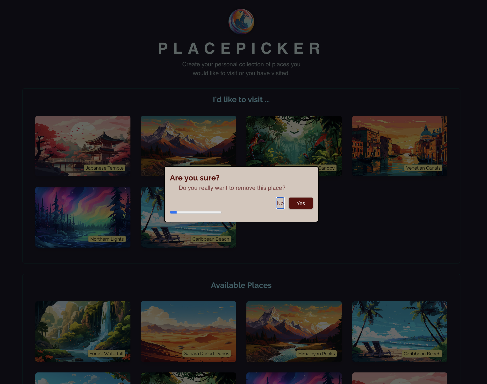

# PlacePicker2

A React application that allows users to create and manage their personal collection of places they would like to visit or have visited.




## 📝 Description

PlacePicker 2 is a simple yet powerful application that demonstrates modern React practices including state management, asynchronous operations, and error handling. Users can browse available places, add them to their personal collection, and remove places they no longer want to track.

## ✨ Features

- Browse a curated list of available places
- Add places to your personal collection
- Remove places from your collection
- Persistent storage through a backend API
- Loading indicators for asynchronous operations
- Error handling with user-friendly messages
- Confirmation dialog with progress bar for deletions

## 🛠️ Tech Stack

- **React** - UI library
- **Vite** - Build tool and development environment
- **React Hooks** - useState, useEffect, useRef, useCallback
- **React Portals** - For modal dialogs
- **Fetch API** - For HTTP requests
- **CSS** - For styling


## 📚 API Endpoints

The application interacts with a backend server running on `http://localhost:3000` with the following endpoints:

- `GET /places` - Retrieves all available places
- `GET /user-places` - Retrieves the user's saved places
- `PUT /user-places` - Updates the user's places collection

## 📁 Project Structure

```
place-picker/
├── src/
│   ├── assets/            # Static assets like images
│   ├── components/        # React components
│   │   ├── AvailablePlaces.jsx
│   │   ├── DeleteConfirmation.jsx
│   │   ├── ErrorPage.jsx
│   │   ├── Modal.jsx
│   │   ├── Places.jsx
│   │   └── ProgressBar.jsx
│   ├── http.js            # API interaction functions
│   ├── App.jsx            # Main application component
│   ├── index.css          # Global styles
│   └── main.jsx           # Application entry point
├── public/                # Public static files
└── index.html             # HTML template
```

## 💡 How It Works

1. When the application loads, it fetches both available places and the user's saved places
2. Users can add places from the available list to their personal collection
3. Users can remove places from their collection with a confirmation dialog
4. All changes are synchronized with the backend server
5. Error handling is in place for failed API requests

